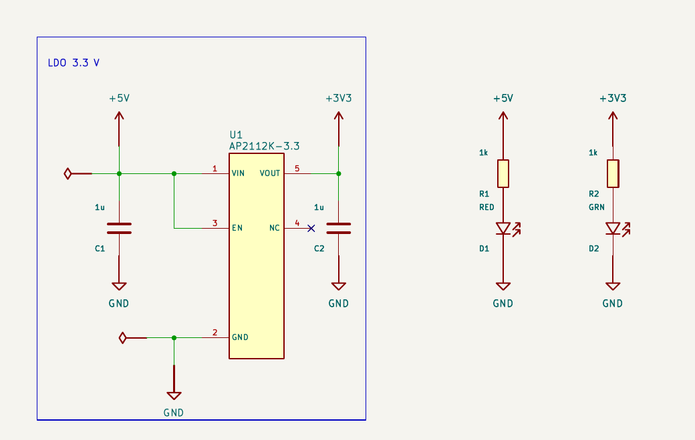

<h1 align="center">wire</h1>

<p align="center"><b>The AI harness for real electronics design.</b><br>
Describe a board. Get a clean, verified KiCad schematic.</p>

<p align="center"></p>

---

## Why now

AI for hardware design has left the lab. When OpenAI launched [GPT-6 Astra](https://openai.com/index/gpt-6-astra/)
on September 3, 2026, one of its headline demos was the model laying out a PCB in KiCad by itself, through
computer use. Electronics design is now a frontier-model use case. The question is no longer whether agents
will design hardware, but how.

## The problem

EDA tools were built for humans: a mouse, menus, a canvas, millimetre coordinates, and a person checking by
eye. An agent driving them through screenshots and clicks is adapting itself to an interface that was never
meant for it. It is slow, brittle, and nothing tells it when it is wrong. Writing KiCad files directly is no
better: a wire only connects if its end lands *exactly* on a pin, so models miss by half a millimetre, run
wires past pins, stack parts and invent pinouts. The result looks plausible and is electrically wrong.

## Our approach: an EDA tool designed for agents

The agent should not adapt to tools, processes and workflows designed for people. The tool should be
designed for the agent. wire starts again from first principles: what does a model need to draw a schematic
right? A medium where the classic mistakes cannot happen, every other one is caught and explained, and the
result is judged by the real tool. Humans get exactly what they use today: a native KiCad project.

- **A grid, not millimetres.** Parts sit in cells; connections happen on cell edges. Nothing is ever "almost
  connected".
- **Frames, one per function.** Buck converter, protection, MCU core: each is a block of the page, moved with
  one coordinate. The agent thinks in functions, like an engineer.
- **Everything is checked.** Every pin, every net, every frame, with errors written for the agent to fix.
- **KiCad is the output and the judge.** wire writes a native KiCad project, then has KiCad compute its own
  netlist and rejects any difference. The agent reviews its pages as KiCad draws them.
- **Real parts, real pinouts.** 22,000+ KiCad symbols imported deterministically, JLCPCB stock and basic
  parts, datasheets read as page images, web search.

## Install

With [Node.js 24+](https://nodejs.org) and git. macOS and Linux:

```sh
curl -fsSL https://raw.githubusercontent.com/leogue/wire/main/install.sh | sh
```

Windows, from PowerShell ([Git for Windows](https://git-scm.com/download/win) provides the Bash the agent uses):

```powershell
irm https://raw.githubusercontent.com/leogue/wire/main/install.ps1 | iex
```

From cmd.exe: `powershell -ExecutionPolicy ByPass -c "irm https://raw.githubusercontent.com/leogue/wire/main/install.ps1 | iex"`.

The agent also needs [KiCad 10](https://www.kicad.org/download/) and poppler (`brew install poppler`,
`apt install poppler-utils`, or `winget install oschwartz10612.Poppler`); the installer says what is missing.
Run it again to update.

## Usage

```sh
mkdir my-board && cd my-board
wire                                   # start the design agent
```

Choose the model with `/login` and `/model` (wire runs on [pi](https://pi.dev)); pick one that accepts
images, since the agent looks at its renders and at datasheet pages. It writes the project (`project.json`,
`sheets/`, `parts/`, `datasheets/`) and delivers `out/`: the KiCad project, a PDF and one PNG per sheet. For
web search, put an [Exa](https://exa.ai) key in `~/.wire/.env`: `EXA_API_KEY=…`.

| Tool | What it does |
|---|---|
| `wire_check` | every check; where each frame and block lies |
| `wire_render` | builds the KiCad project (nets verified) and returns each page as an image |
| `wire_netlist` | the nets, pin by pin |
| `wire_erc` | KiCad's electrical rules check |
| `wire_parts` | search built-in parts, KiCad's symbol library, or JLCPCB's stock (`jlc`, `basic`) |
| `wire_show` | a part's pins and their sides on the grid; a JLCPCB part's stock, price and the symbol to use |
| `wire_import` | copy a KiCad symbol into the project as a block |
| `wire_datasheet` | a datasheet as page images (≤ 8 pages), or an index of its pages and the pages asked for |
| `web_search` | search the web (Exa) |
| `read`, `bash`, `edit`, `write` | pi's own |

The design knowledge (format, work loop, how an engineer draws) is the skill in
[`packages/agent/skills/wire/SKILL.md`](packages/agent/skills/wire/SKILL.md), included whole in the system
prompt. When the agent stops on a project that fails its checks, it is sent back to fix it (three times at
most). It has shell access and is not sandboxed: run it on your own machine, in a project folder.

### Commands

Everything the agent does is also a `wire` command:

```sh
wire check examples/ldo-indicator            # checks, and where each frame lies
wire render examples/ldo-indicator           # KiCad project, PDF and PNGs in examples/ldo-indicator/out/
wire erc examples/ldo-indicator              # KiCad's ERC
wire netlist examples/ldo-indicator

wire parts "ldo 3.3"                          # built-in parts, then KiCad symbols
wire show Amplifier_Operational:LM358         # pins and units of a KiCad symbol
wire import Regulator_Linear:AP2112K-3.3 .    # as ./parts/AP2112K-3.3.json
wire parts "100nF 0402" --jlc --basic         # JLCPCB parts in stock
wire show C51118                              # stock, price, datasheet, symbol to use
wire datasheet https://www.diodes.com/assets/Datasheets/AP2112.pdf . --pages 1,2
wire web "AP2112 reference design"
wire help
```

## The format

A project folder:

```
project.json        {"name": "...", "sheets": ["power", "mcu"], "defaults": {...}}
sheets/<name>.json  one page, made of frames
parts/<Name>.json   the project's blocks (ICs, connectors) and any extra basic part
datasheets/         PDFs and their rendered pages
```

**The grid.** A cell is `[column, row]` (10.16 mm, 4 × KiCad's 2.54 mm pitch), rows going down. Two
neighbouring cells whose facing sides both carry a port are connected; a port facing nothing is an error.

**Frames.** A sheet's frames each have their own grid (`[0, 0]` is the frame's top-left cell, row 0 is its
title). Frames do not overlap, leave the paper (`"paper": "A4" | "A3" | "A2"`) or cover the title block; no
wire leaves a frame: frames connect through labels and power symbols. `"border": false` hides a small
group's box.

**Cells.**

| Cell | Example |
|---|---|
| basic part | `{"at": [0, 2], "tile": "R", "ref": "R1", "value": "10k", "rot": 90}` |
| power | `{"at": [0, 1], "tile": "PWR", "net": "+3V3"}` · `{"at": [0, 4], "tile": "GND"}` |
| IC unit | `{"at": [3, 1], "block": "AP2112K-3.3", "ref": "U1", "mode": "wired"}` |
| | `{"at": [0, 1], "block": "STM32G031F6Px", "unit": "PA", "ref": "U1", "mode": "label", "nets": {"PA13": "SWDIO"}, "unused": "NC"}` |
| wire | `{"at": [1, 2], "wire": "NSE"}` (joins those sides) · `"NS\|EW"` (crossing, not connected) |
| run | `{"run": [[1, 3], [6, 3]]}` |
| label | `{"at": [7, 4], "label": "I2C_SDA", "side": "W"}` |
| note | `{"at": [0, 8], "text": "VOUT = 0.8 × (1 + R1/R2)"}` |

**Parts.** A *tile* is a basic component drawn in one cell (23 built in: passives, diodes, transistors,
power symbols); its value is given when placing it. A *block* is an IC or connector: a pin table and
*units* listing pin numbers down their west and east sides; its drawing is computed. Splitting a large IC
by function or reordering its pins is editing `units`. Each placement chooses `wired` (one pin per row,
wired like a tile) or `label` (2.54 mm pitch, a net name per pin). Blocks come from KiCad
(`wire import`) and keep their `source`: `check` reports a pin table that no longer matches KiCad's.

**Nets and references.** The same name (label, power symbol, label-mode pin) is the same net everywhere in the
project. References are unique across the project; the units of one block share theirs.

The JSON Schemas are in [`packages/format/schemas/`](packages/format/schemas) (`wire schema sheet`).

## Repository

| Package | Role |
|---|---|
| [`packages/format`](packages/format) | zod schemas of every file (the single source of truth) and the generated JSON Schemas |
| [`packages/library`](packages/library) | the built-in basic parts |
| [`packages/core`](packages/core) | loading, layout of frames, sheets and projects, every check, the netlist |
| [`packages/kicad`](packages/kicad) | KiCad export verified against KiCad's netlist; PDF, PNG and ERC through `kicad-cli`; KiCad symbol import |
| [`packages/cli`](packages/cli) | the `wire` command; JLCPCB search, datasheets, web search |
| [`packages/agent`](packages/agent) | the pi extension (tools), system prompt, skill and launcher |
| [`examples`](examples) | reference projects |

```sh
npm test            # vitest; tests needing KiCad or poppler are skipped without them
npm run typecheck   # TypeScript 7, strict
npm run schema      # regenerate the JSON Schemas after changing packages/format
```

Node runs the TypeScript sources directly: there is no build step. From a clone, `npm install`, then
`npm run wire -- …` runs the `wire` command.

